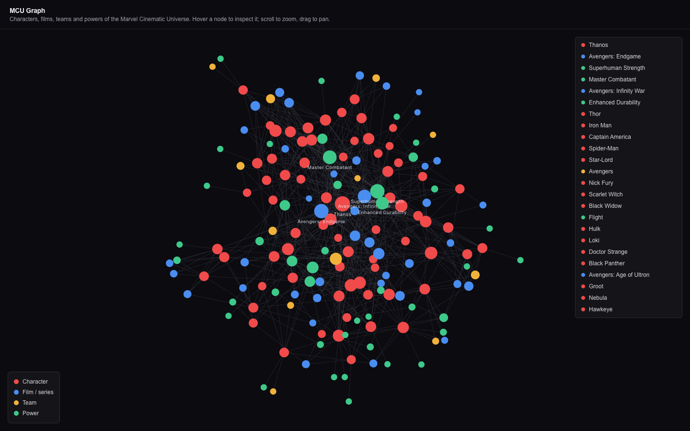
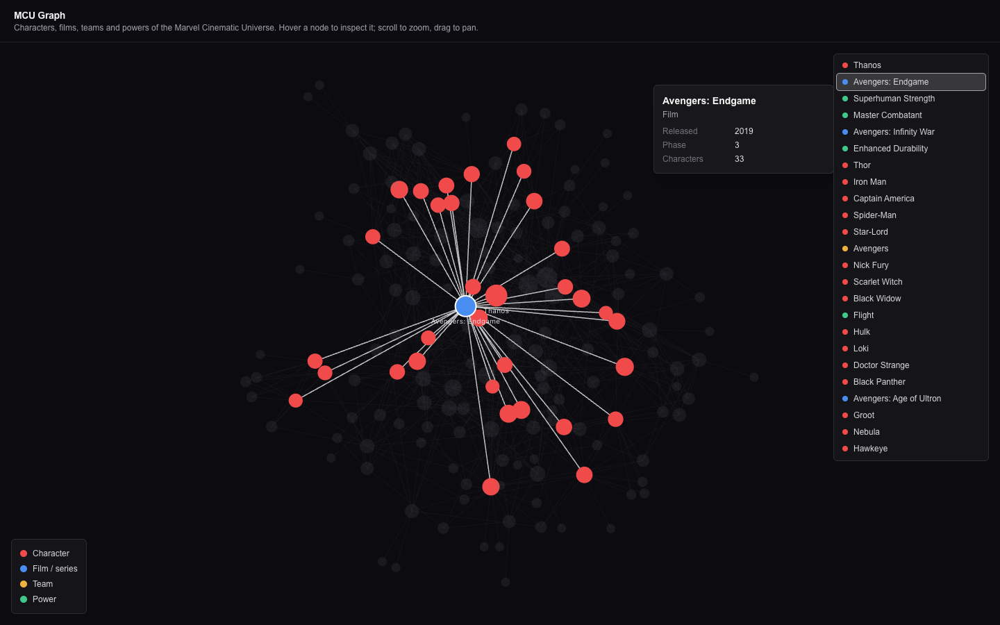

# 🕸️ MCU Graph

> An interactive force-directed graph of the Marvel Cinematic Universe — characters, films, teams and powers as one explorable web.


**Live:** <https://mcu-graph.vercel.app>

The "graph of things" visual familiar from Obsidian's graph view, applied to the MCU.
Search for a character or hover any node to inspect it; scroll to zoom, drag to pan.
Selecting a character highlights it and its direct neighbours while dimming everything else.



Hovering *Avengers: Endgame* lights up its 33 connected characters:



## What's in the graph

**167 nodes, 661 links**, compiled from a curated seed:

| Node type | Count | |
|---|---|---|
| 🔴 Character | 71 | Heroes, villains and supporting cast |
| 🔵 Film / series | 41 | Phases 1–6, including Disney+ series |
| 🟡 Team | 12 | Avengers, Guardians, Wakandans, X-Men… |
| 🟢 Power | 43 | Flight, super strength, magic, time manipulation… |

Edges: `APPEARS_IN`, `MEMBER_OF`, `HAS_POWER`, `ALLY_OF`, `ENEMY_OF`.
Node colour encodes type; node radius encodes degree centrality.

## Tech stack

| Layer | Technology |
|---|---|
| Framework | Next.js 16 (App Router, TypeScript strict, Turbopack) |
| Rendering | [`react-force-graph-2d`](https://github.com/vasturiano/react-force-graph) on HTML canvas |
| Styling | Tailwind CSS v4 |
| Testing | Vitest (41 tests) |
| Data | Curated seed JSON + the [SuperHero dataset](https://akabab.github.io/superhero-api/) |
| Deploy | Static export (`output: 'export'`) — no server, no database |

## Getting started

```bash
npm install
npm run dev          # compiles the graph, then serves http://localhost:3000
```

Other commands:

```bash
npm run ingest:superhero   # refresh data/raw/superhero.json (no API key needed)
npm run build:graph        # compile data/ -> public/data/graph.json
npm run build              # static export to out/
npm run lint
npm test
```

## Deployment

Hosted on Vercel as a pure static export — no server, no database, no env vars.
The GitHub repo is connected, so **pushes to `main` deploy automatically**.

```bash
vercel --prod   # manual deploy, if ever needed
```

`data/raw/` is committed, so the production build never calls an external API and
cannot fail on rate limits.

## How the data is built

```
data/characters.seed.json    curated spine, hand-maintained
data/raw/superhero.json      committed snapshot (powerstats, aliases)
        │
        ▼   scripts/build-graph.ts  ->  src/lib/build-graph.ts (pure, 18 tests)
public/data/graph.json       generated, gitignored
        │
        ▼   fetched by the client and rendered on canvas
```

The curated seed is the **spine**. Every character carries explicit foreign keys
(`superheroId`, plus `tmdbId` / `marvelId` / `wikidataQid` reserved as `null`), so
enrichment is always a lookup by ID — never a fuzzy name match, which would silently
mis-join characters like the two different Captain Marvels. See
[ADR 0001](docs/adr/0001-curated-seed-spine.md).

`data/raw/` is committed deliberately: builds stay reproducible, offline and free of
API rate limits in CI. See [ADR 0002](docs/adr/0002-static-export-no-database.md).

## Accessibility

- Canvas content is mirrored into a focusable node list (ordered by degree), so the
  graph is reachable by keyboard — `Tab` selects a node and shows the same tooltip.
- The character search matches names and aliases, highlights the first matching character,
  and offers matching results for direct selection. Press `Escape` to clear it.
- `prefers-reduced-motion` freezes the simulation and renders a pre-settled layout.
- The node list is hidden below the `sm` breakpoint so the graph gets the full mobile
  viewport.

## Scope

v1 is **the visualization and nothing else** — the graph plus a plain-text hover
tooltip. Deliberately no trading cards, no detail panel, no collection layer.
See [docs/spec.md](docs/spec.md) for the full backlog: Wikidata / TMDB / Marvel API
ingestion, filters and search, and a detail panel.

## Known limitations

- **Film appearances are hand-entered** in the seed, so they're the main source of
  factual error until TMDB ingestion lands.
- **Powerstats are comics values**, not MCU canon. In v1 they only influence node
  sizing; any UI that surfaces them must label them "Comics power stats".
- **~71 characters is a deliberate cap.** Wikidata knows about 1,195 MCU entities,
  which would render as an unreadable hairball.

## Legal note

Marvel characters are Disney-owned IP. This is a free, non-commercial fan project that
only *displays* publicly available data. Minting or trading these characters as NFTs
would be copyright and trademark infringement — Disney licenses official Marvel NFTs
exclusively through VeVe. The backlog collection layer is therefore an off-chain
simulation behind an interface, and no Marvel asset is ever tokenised.

Adding TMDB or Marvel API data will require attribution in the footer.
